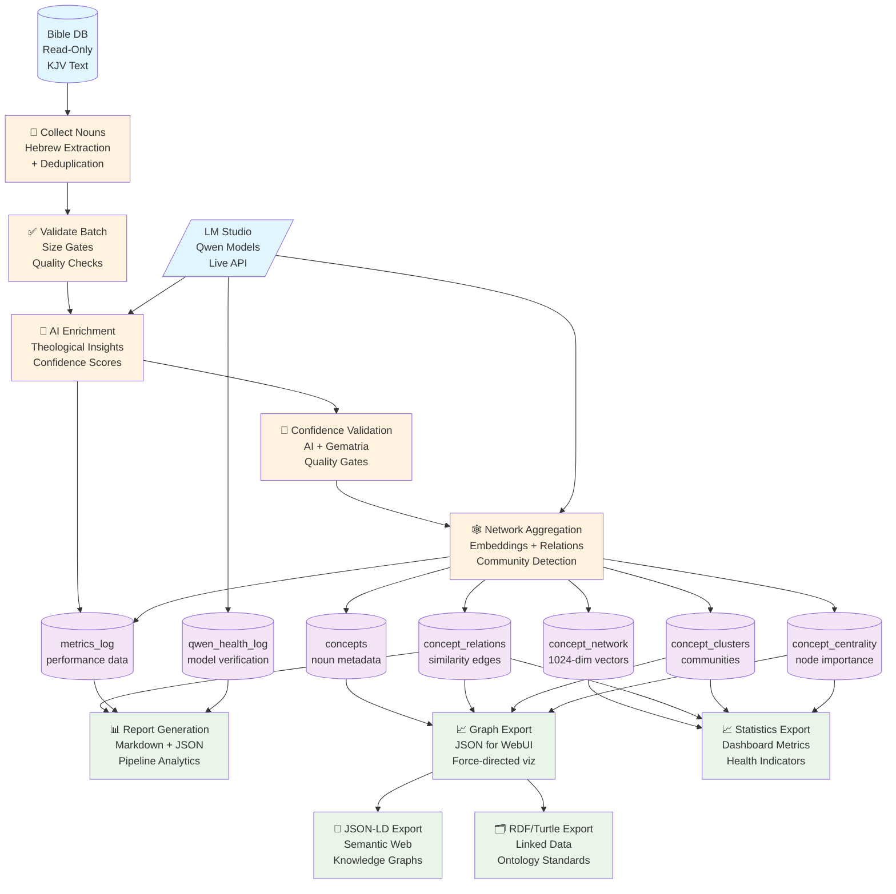
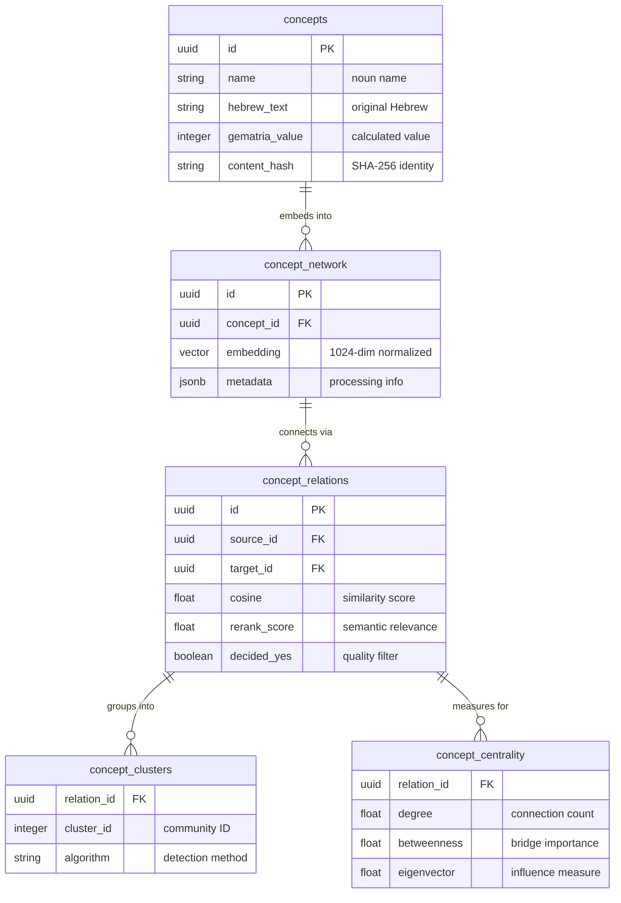

# Gemantria Data Flow Architecture

## Complete Pipeline Overview

## Key Data Transformations

### 1. Collection Stage
**Input**: Raw KJV Bible text  
**Process**: Hebrew noun extraction, deduplication, normalization  
**Output**: Structured noun objects with IDs and metadata

### 2. Validation Stage  
**Input**: Noun list with metadata  
**Process**: Batch size checks, quality gates, ALLOW_PARTIAL logic  
**Output**: Validated batch or detailed error manifest

### 3. Enrichment Stage
**Input**: Validated nouns  
**Process**: AI prompt engineering, LM Studio API calls, response parsing  
**Output**: Nouns with theological insights and confidence scores

### 4. Confidence Validation Stage
**Input**: AI-enriched nouns  
**Process**: Multi-gate validation (gematria ≥90%, AI ≥85% soft/95% hard)  
**Output**: Filtered noun list with validation evidence

### 5. Network Aggregation Stage
**Input**: Confidence-validated nouns  
**Process**: Embedding generation (1024-dim), KNN relations, community detection  
**Output**: Semantic network with relations, clusters, and centrality measures

## Storage Schema Overview

## Quality Gates & Safety

### Pre-Processing
- ✅ **Qwen Live Gate**: All models verified before pipeline starts
- ✅ **Batch Size Gate**: ≥50 nouns unless ALLOW_PARTIAL=1 explicit
- ✅ **Hebrew Normalization**: NFKD→strip→NFC verified

### Processing
- ✅ **Confidence Gates**: AI soft≥85%, hard≥95%; Gematria≥90%
- ✅ **Embedding Quality**: 1024-dim vectors, L2 normalized
- ✅ **Relation Thresholds**: Strong≥0.90, weak≥0.75

### Post-Processing
- ✅ **Real Data Verification**: Reports contain actual metrics
- ✅ **Export Completeness**: All fields populated
- ✅ **Schema Compliance**: JSON-LD/RDF validation

## Performance Characteristics

| Stage | Throughput | Bottleneck |
|-------|------------|------------|
| Collection | ~1000 nouns/sec | Database queries |
| Enrichment | ~5 nouns/min | LM Studio API |
| Network | ~500 embeddings/sec | Vector operations |
| Validation | ~1000 items/sec | In-memory processing |

**Total Pipeline**: ~30-45 minutes for 1000 nouns (API-limited)

## Failure Recovery

- 🔄 **Transactional Safety**: All DB writes wrapped in transactions
- 🔄 **Checkpointer Resume**: Pipeline state survives restarts
- 🔄 **ALLOW_PARTIAL Override**: Processes incomplete batches when needed
- 🔄 **Node Isolation**: Individual failures don't stop entire pipeline

This architecture ensures **deterministic, resumable, observable** processing with **comprehensive quality gates** throughout the entire data pipeline.
