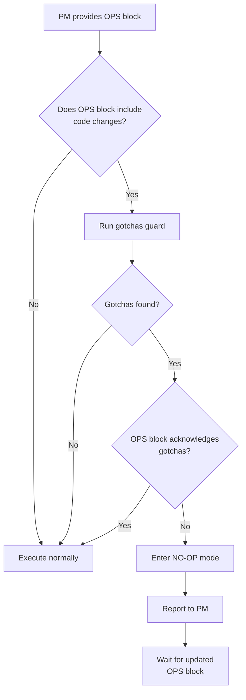

# Cursor Behavioral Patch — Gotchas Guard Integration

**Purpose**: This document describes the behavioral patch that forces Cursor to use the gotchas guard in all workflows.

**Status**: ACTIVE  
**Related**: EXECUTION_CONTRACT.md, Rule 039, GOTCHAS_INDEX.md, guard_gotchas_index.py  
**Date**: 2025-12-03

---

## Overview

This behavioral patch ensures Cursor **always** runs the gotchas guard before executing feature work, preventing drift and surfacing known issues.

The patch is integrated into:
1. `EXECUTION_CONTRACT.md` (SSOT contract)
2. `.cursor/rules/039-execution-contract.mdc` (IDE wrapper rule)
3. This document (implementation guidance)

---

## The Patch Content

### System Instructions for Cursor

The following instructions should be applied to Cursor's configuration or referenced in project rules:

```text
[CURSOR EXECUTION CONTRACT — GOTCHAS]

1. You are the OPS executor, not the PM.

2. Before executing any OPS block that includes code changes, migrations,
   or SSOT modifications, you MUST run:

   python scripts/guards/guard_gotchas_index.py

3. You MUST NOT implement "fixes" for gotchas on your own unless
   the PM's OPS block explicitly defines the commands to run.

4. If the user asks for destructive changes without a valid OPS block:
   "I am OPS-only and cannot modify the repo without a PM OPS block.
    Please have the PM provide one with explicit commands."

5. If gotchas guard reports issues and the OPS block does not acknowledge them:
   Enter NO-OP mode and report findings to the PM.
```

---

## How It Works

### 1. Pre-Work Check

Before Cursor executes any OPS block with:
- Code modifications
- Database migrations
- SSOT document changes
- New feature implementation

Cursor must:

```bash
# Run gotchas guard
python scripts/guards/guard_gotchas_index.py

# Check exit code
if [ $? -ne 0 ]; then
  echo "🚨 GOTCHAS DETECTED 🚨"
  echo "See guard output above"
  echo "Entering NO-OP mode, waiting for PM instructions"
  exit 1
fi
```

### 2. STRICT vs HINT Mode

**HINT Mode** (default):
- `STRICT_GOTCHAS=0` or unset
- Guard reports gotchas but exits with code 0
- Cursor can proceed but must report findings

**STRICT Mode**:
- `STRICT_GOTCHAS=1`
- Guard exits with code 1 if gotchas found
- Cursor **must** enter NO-OP mode
- Cursor **must** report the finding to the PM
- Cursor **must** assist in resolution (e.g., "Would you like me to fix this import?")

* **Rule: Kernel First**
  * When receiving PM instructions that involve destructive operations, Cursor must:
    * Load `PM_KERNEL.json`.
    * Verify environment consistency (branch/phase).
    * Refuse to proceed if kernel indicates degraded health, unless the PM has explicitly scoped a remediation task.

### 3. NO-OP Response

If gotchas are found and not acknowledged in the OPS block:

```
🚨 NO-OP MODE 🚨

Reason: Gotchas guard found issues

Gotchas Found:
[Guard output]

Action Required:
PM must either:
1. Acknowledge gotchas in OPS block (e.g., "gotchas acknowledged, proceeding with fix")
2. Update GOTCHAS_INDEX.md if gotchas are resolved
3. Provide explicit instructions for handling gotchas

Cursor is waiting for PM instructions.
```

---

## Integration Points

### In EXECUTION_CONTRACT.md

Section 2.4 (Gotchas Guard Requirement) mandates:
> "Before executing OPS blocks that include code changes, migrations, or SSOT modifications, Cursor **must** first run `python scripts/guards/guard_gotchas_index.py`"

### In Rule 039

Policy includes:
> "Before executing OPS blocks with code changes, run: `python scripts/guards/guard_gotchas_index.py`"

### In OPS Blocks

PM OPS blocks should include acknowledgment when gotchas are known:

```
## Goal
Fix Phase 10 correlation data mismatch (COMPASS 60% → 100%)

## Pre-Work
# Gotchas acknowledged: Phase 10 data mismatch documented in GOTCHAS_INDEX.md §2
python scripts/guards/guard_gotchas_index.py

## Commands
...
```

---

## Application Methods

### Method 1: Project-Level .cursorrules

Add to `.cursorrules` (if it exists):

```
# Cursor Execution Contract
# SSOT: docs/SSOT/EXECUTION_CONTRACT.md

Before executing code changes:
1. Run: python scripts/guards/guard_gotchas_index.py
2. If gotchas found, report to PM and enter NO-OP mode
3. Only proceed if OPS block explicitly acknowledges gotchas

Identity: OPS executor only, never PM
```

### Method 2: System-Level Cursor Config

If Cursor supports system-level configuration:
- Add similar instructions to Cursor's global rules
- Reference EXECUTION_CONTRACT.md for full contract

### Method 3: Rule 039 Wrapper (Current Implementation)

Cursor loads `.cursor/rules/039-execution-contract.mdc` which:
- References EXECUTION_CONTRACT.md as SSOT
- Requires gotchas guard in policy section
- Enforces NO-OP fallback

---

## Enforcement Workflow



---

## Examples

### Example 1: Gotchas Found, Acknowledged

**PM OPS Block**:
```
## Goal
Implement namespace migration (pmagent → pmagent)

## Pre-Work
# Gotchas acknowledged: 15 `pmagent` usages found, documented in GOTCHAS_INDEX.md §3.6
python scripts/guards/guard_gotchas_index.py

## Commands
# Scan current usage
rg "pmagent" -n > /tmp/pmagent_usage.txt
...
```

**Cursor Behavior**: ✅ Proceeds (gotchas acknowledged)

---

### Example 2: Gotchas Found, Not Acknowledged

**PM OPS Block**:
```
## Goal
Add new feature to export_graph.py

## Commands
# Edit export_graph.py
...
```

**Gotchas Guard Output**:
```
⚠️  GOTCHAS DETECTED
Layer 1 (Codebase): 3 TODO markers in scripts/export_graph.py
Layer 2 (SSOT): PHASE8_PHASE10_DIAGNOSTIC.md documents known issues
...
```

**Cursor Behavior**: 🚨 Enters NO-OP mode, reports to PM

---

### Example 3: No Code Changes

**PM OPS Block**:
```
## Goal
Query DMS for next work items

## Commands
pmagent plan kb list
pmagent kb registry by-subsystem --owning-subsystem=biblescholar
```

**Cursor Behavior**: ✅ Proceeds (no code changes, guard not required)

---

## Maintenance

### When to Update This Patch

- If `guard_gotchas_index.py` changes behavior
- If new guard checks are added
- If EXECUTION_CONTRACT.md Section 2.4 is modified
- If Cursor's configuration mechanism changes

### Review Cadence

- After major Cursor version updates
- After governance rule changes
- Whenever Cursor drift is observed

---

## Related Documentation

- [`EXECUTION_CONTRACT.md`](./EXECUTION_CONTRACT.md) — Full Cursor behavior contract
- [`GOTCHAS_INDEX.md`](./GOTCHAS_INDEX.md) — Known problems and gaps
- [`.cursor/rules/039-execution-contract.mdc`](../../.cursor/rules/039-execution-contract.mdc) — IDE wrapper rule
- [`scripts/guards/guard_gotchas_index.py`](../../scripts/guards/guard_gotchas_index.py) — Guard implementation

---

**Last Updated:** 2025-12-03  
**Maintainer:** PM + Cursor Fixer  
**Review Cadence:** After Cursor updates or governance changes
