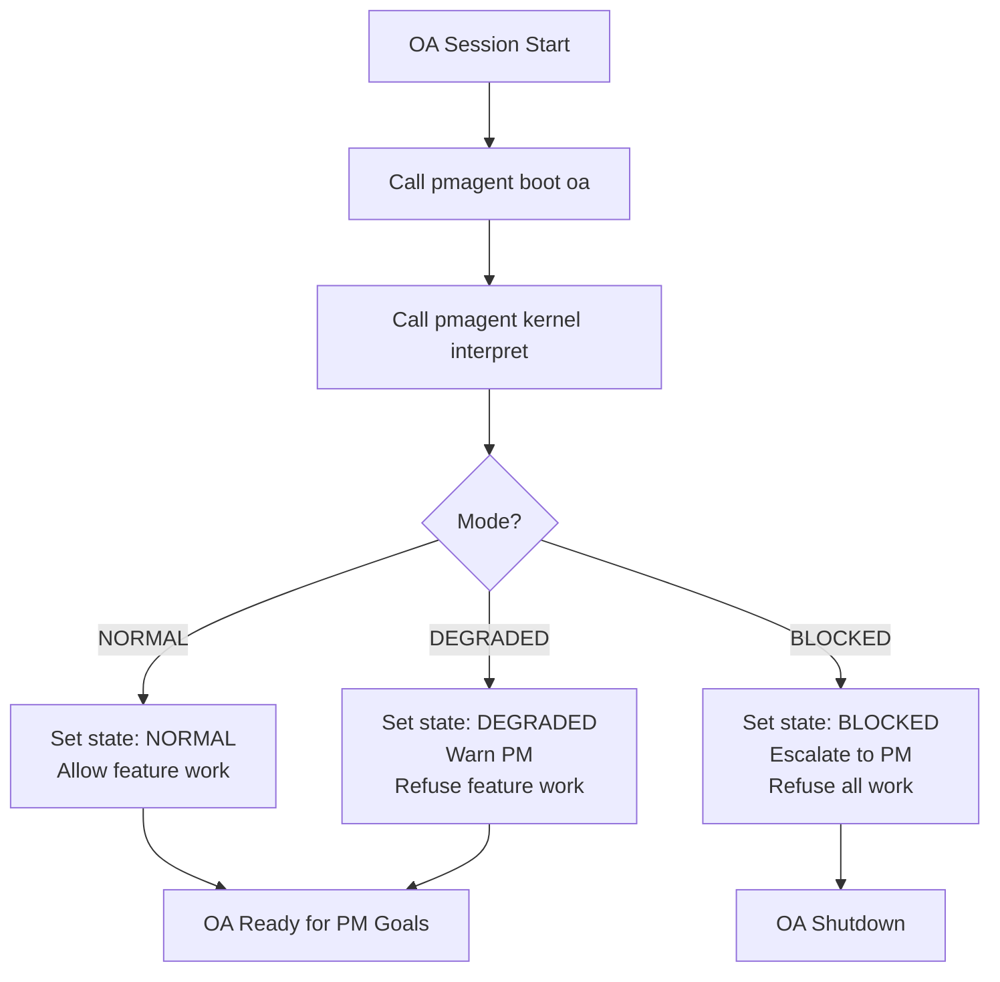

# PHASE27_B_OA_RUNTIME.md — Minimal OA Runtime

## Problem Statement

Orchestrator Assistant (OA) currently exists as:
- PM asking questions to an LLM
- No formal boot sequence
- No state tracking across conversations
- No systematic way to draft OPS blocks
- Manual orchestration: PM → Cursor (no OA in the loop)

**Result:** OA is underutilized. PM is still the manual orchestrator.

---

## Objectives

Build a **minimal OA runtime** that:

1. **Boots from kernel** — OA's first action is always to read and interpret kernel state
2. **Drafts OPS blocks** — OA generates structured OPS blocks for Cursor to execute (not freestyle prompts)
3. **Tracks session state** — OA remembers kernel mode at boot, detects drift, escalates on failures
4. **Integrates with pmagent** — OA calls `pmagent kernel interpret`, not raw JSON parsing

---

## OA Boot Sequence

### Step-by-Step Boot



### Boot Command: `pmagent boot oa`

**Returns:**
```json
{
  "oa_boot_envelope": {
    "timestamp": "2024-12-06T15:30:00Z",
    "kernel": {
      "phase": "26",
      "branch": "main",
      "mode": "NORMAL"
    },
    "interpretation": {
      "allowed_actions": ["feature_work", "ops_blocks"],
      "forbidden_actions": [],
      "recommended_commands": []
    },
    "session_metadata": {
      "session_id": "oa-session-12345",
      "pm_user": "mccoy",
      "workspace": "/home/mccoy/Projects/Gemantria.v2"
    }
  }
}
```

**OA Runtime Logic:**
```python
def boot_oa_session():
    boot_data = subprocess.run(
        ["pmagent", "boot", "oa", "--format", "json"],
        capture_output=True
    )
    envelope = json.loads(boot_data.stdout)
    
    mode = envelope["kernel"]["mode"]
    interpretation = envelope["interpretation"]
    
    if mode == "BLOCKED":
        notify_pm("🛑 System BLOCKED. OA cannot start. Escalate immediately.")
        sys.exit(1)
    elif mode == "DEGRADED":
        notify_pm(f"⚠️ System DEGRADED: {envelope['interpretation']['summary']}")
        set_oa_state("DEGRADED", allowed=["remediation"], forbidden=["feature_work"])
    else:
        set_oa_state("NORMAL", allowed=interpretation["allowed_actions"], forbidden=[])
    
    return envelope
```

---

## OPS Block Drafting Protocol

### OPS Block Structure

OA drafts OPS blocks following this template:

```markdown
## 🟦 OPS MODE — [Goal Title]

**Governance:** Gemantria OPS v6.2.3 (tool-aware, 050 + 051 + 052 active)

## Goal

[One-sentence description of the goal]

## Preflight

Source: [SSOT doc references, e.g., AGENTS.md, PHASE27_INDEX.md]

### Kernel Status
- Phase: [from PM_KERNEL.json]
- Branch: [from PM_KERNEL.json]
- Mode: [from pmagent kernel interpret]
- Health: [from pmagent kernel interpret]

### Guards Required
- [ ] `make reality.green` 
- [ ] `make ops.kernel.check`
- [ ] [any other relevant guards]

## Commands

```bash
# Command 1: [description]
[actual command]

# Command 2: [description]
[actual command]
```

## Evidence to Return

1. [Output of command 1]
2. [Output of command 2]
3. [Any files created/modified]

## Next Gate

[What should happen after this OPS block completes?]
- If success: [next action]
- If failure: [escalation path]
```

### OA Drafting Logic

**Input:** PM goal (e.g., "Implement Phase 27.A kernel interpreter")

**OA Process:**
1. Query `pmagent kernel interpret` — ensure mode allows feature work
2. Query SSOT docs for relevant specs (e.g., `PHASE27_A_PMAGENT_KERNEL_INTERPRETER.md`)
3. Query hints registry for relevant commands (e.g., `pmagent.boot` hints)
4. Draft OPS block with:
   - Kernel status from boot envelope
   - Commands from hints + SSOT specs
   - Evidence requirements
   - Success/failure gates
5. Return draft to PM for approval
6. After PM approval, send to Cursor for execution

**Example OA Interaction:**

```
PM: "Implement Phase 27.A kernel interpreter"

OA (internal):
  - Checks kernel mode: NORMAL ✅
  - Reads PHASE27_A spec
  - Finds relevant commands: pmagent kernel interpret design
  - Drafts OPS block

OA (to PM):
  "I've drafted an OPS block for Phase 27.A implementation.
   
   Summary:
   - Create pmagent/kernel/interpreter.py
   - Add CLI command: pmagent kernel interpret
   - Update guard_kernel_boot.py to use interpreter
   - Write test vectors TV-27A-01 through TV-27A-04
   
   Review draft? [Link to artifact]"
```

---

## State Tracking

### Session State Schema

```python
@dataclass
class OASessionState:
    session_id: str
    boot_timestamp: str
    kernel_mode_at_boot: Literal["NORMAL", "DEGRADED", "BLOCKED"]
    current_kernel_mode: Literal["NORMAL", "DEGRADED", "BLOCKED"]
    allowed_actions: list[str]
    forbidden_actions: list[str]
    pending_ops_blocks: list[str]  # OPS block IDs awaiting Cursor execution
    completed_ops_blocks: list[str]
    escalations: list[dict]
```

### Drift Detection

OA periodically checks if kernel state has changed since boot:

```python
def check_kernel_drift(state: OASessionState):
    current = subprocess.run(
        ["pmagent", "kernel", "interpret", "--format", "json"],
        capture_output=True
    )
    current_mode = json.loads(current.stdout)["mode"]
    
    if current_mode != state.kernel_mode_at_boot:
        notify_pm(
            f"⚠️ Kernel mode drift detected!\n"
            f"Boot mode: {state.kernel_mode_at_boot}\n"
            f"Current mode: {current_mode}\n"
            f"Recommend OA restart."
        )
        state.escalations.append({
            "type": "mode_drift",
            "boot_mode": state.kernel_mode_at_boot,
            "current_mode": current_mode,
            "timestamp": datetime.now().isoformat()
        })
```

### State Persistence

**Phase 27 (Minimal):** In-memory only
- State lives in OA process memory
- Lost on OA restart
- Acceptable for initial version

**Phase 28+ (Future):** DMS-backed persistence
- State written to `share/oa_session_state.json`
- Survives OA restarts
- Enables session replay and auditing

---

## LM Studio Tool Belt Integration (Optional)

If LM Studio OA runtime is ready, provide tool wrappers:

### Tool 1: `get_kernel_status()`

```python
def get_kernel_status() -> dict:
    """LM Studio tool: Get current kernel status and interpretation."""
    result = subprocess.run(
        ["pmagent", "kernel", "interpret", "--format", "json"],
        capture_output=True
    )
    return json.loads(result.stdout)
```

### Tool 2: `draft_ops_block(goal: str) -> str`

```python
def draft_ops_block(goal: str) -> str:
    """LM Studio tool: Draft an OPS block for the given PM goal."""
    # OA drafting logic (simplified)
    kernel = get_kernel_status()
    if "feature_work" not in kernel["interpretation"]["allowed_actions"]:
        return "❌ Cannot draft OPS block: system is DEGRADED. Remediation required."
    
    # Query SSOT docs, hints, etc. and generate OPS block
    ops_block = generate_ops_block_template(goal, kernel)
    return ops_block
```

### Tool 3: `check_oa_state() -> OASessionState`

```python
def check_oa_state() -> dict:
    """LM Studio tool: Return current OA session state."""
    return asdict(current_oa_session_state)
```

**LM Studio Configuration:**
```json
{
  "tools": [
    {"name": "get_kernel_status", "description": "Get kernel mode and health"},
    {"name": "draft_ops_block", "description": "Draft OPS block for PM goal"},
    {"name": "check_oa_state", "description": "Check OA session state"}
  ]
}
```

---

## Escalation Patterns

### Escalation Triggers

| Trigger | OA Response | PM Notification | Next Action |
|---------|-------------|-----------------|-------------|
| **Mode = DEGRADED at boot** | Warn PM, refuse feature work | ⚠️ "System degraded, remediation needed" | PM runs remediation commands |
| **Mode = BLOCKED at boot** | Refuse to start, escalate | 🛑 "System blocked, manual intervention required" | PM investigates manually |
| **Cursor reports guard failure** | Pause work, escalate | ⚠️ "Cursor hit guard failure during OPS block" | PM reviews guard output, approves override or remediation |
| **Mode drift detected** | Warn PM, recommend restart | ⚠️ "Kernel mode changed since boot" | PM restarts OA session |

### Escalation Message Template

```
⚠️ OA ESCALATION

Type: [mode_degraded | mode_blocked | guard_failure | mode_drift]
Severity: [warn | block]
Timestamp: [ISO 8601]

Details:
[Specific reason, e.g., "reality.green failed: 3 lint errors"]

Recommended Action:
[Specific commands to run, e.g., "make housekeeping"]

Current OA State:
- Mode at boot: [NORMAL/DEGRADED/BLOCKED]
- Current mode: [NORMAL/DEGRADED/BLOCKED]
- Pending OPS blocks: [count]
```

---

## Implementation Plan

### File Structure

```
pmagent/
  oa/
    __init__.py
    runtime.py              # OA session state + boot logic
    drafting.py             # OPS block template generator
    tools.py                # LM Studio tool wrappers (optional)
  cli.py                    # Add 'pmagent boot oa' command
  
scripts/
  oa/
    start_oa_session.py     # Standalone OA session launcher (optional)
```

### Core Logic (`runtime.py`)

```python
from dataclasses import dataclass, asdict
from typing import Literal
import subprocess
import json

@dataclass
class OASessionState:
    session_id: str
    boot_timestamp: str
    kernel_mode_at_boot: Literal["NORMAL", "DEGRADED", "BLOCKED"]
    allowed_actions: list[str]
    forbidden_actions: list[str]
    escalations: list[dict]

def boot_oa_session() -> OASessionState:
    """Boot OA session from kernel."""
    result = subprocess.run(
        ["pmagent", "kernel", "interpret", "--format", "json"],
        capture_output=True, text=True
    )
    interpretation = json.loads(result.stdout)
    
    state = OASessionState(
        session_id=generate_session_id(),
        boot_timestamp=datetime.now().isoformat(),
        kernel_mode_at_boot=interpretation["mode"],
        allowed_actions=interpretation["interpretation"]["allowed_actions"],
        forbidden_actions=interpretation["interpretation"]["forbidden_actions"],
        escalations=[]
    )
    
    if state.kernel_mode_at_boot == "BLOCKED":
        raise RuntimeError("Cannot boot OA: system is BLOCKED")
    
    return state
```

---

## Testing Strategy

### Test Vectors

**TV-27B-01: OA Boot in NORMAL Mode**
- Setup: Kernel mode = NORMAL, all guards green
- Expected: OA boots successfully, allows feature work

**TV-27B-02: OA Boot in DEGRADED Mode**
- Setup: Kernel mode = DEGRADED, reality.green failed
- Expected: OA boots with warning, refuses feature work, recommends remediation

**TV-27B-03: OA Boot in BLOCKED Mode**
- Setup: Kernel missing or corrupted
- Expected: OA refuses to boot, escalates to PM

**TV-27B-04: OPS Block Drafting**
- Input: PM goal "Implement Phase 27.A"
- Expected: OA returns valid OPS block with commands, evidence, gates

**TV-27B-05: Mode Drift Detection**
- Setup: Boot in NORMAL, then simulate mode change to DEGRADED
- Expected: OA detects drift, notifies PM

### Manual Verification

1. Boot OA session: `pmagent boot oa`
2. Verify output includes kernel mode, allowed actions
3. Request OPS block draft via LM Studio (if tool belt ready)
4. Verify OPS block includes kernel status, commands, evidence

---

## Success Criteria

27.B is DONE when:

1. ✅ `pmagent boot oa` command exists and returns boot envelope
2. ✅ OA boot sequence documented (this spec)
3. ✅ OPS block drafting protocol specified
4. ✅ State tracking mechanism designed (in-memory for Phase 27)
5. ✅ Escalation patterns documented
6. ✅ Test vectors pass (at least TV-27B-01, TV-27B-02, TV-27B-03)
7. ✅ LM Studio tool belt optional but documented (can defer to Phase 28)

---

## Open Questions for PM

1. **LM Studio Integration:**
   - Should Phase 27.B include LM Studio tool belt, or defer to Phase 28?
   - Recommendation: Document tools in this spec, defer implementation to Phase 28.

2. **State Persistence:**
   - In-memory (ephemeral) for Phase 27, or DMS-backed from start?
   - Recommendation: In-memory for Phase 27, DMS-backed in Phase 28.

3. **OPS Block Approval:**
   - Should OA send drafts to PM for approval, or directly to Cursor?
   - Recommendation: PM approval for Phase 27, direct-to-Cursor in Phase 28.

---

## Dependencies

- Phase 26: Kernel enforcement complete
- Phase 27.A: `pmagent kernel interpret` exists
- `pmagent status handoff` command operational
- SSOT docs available for OPS block drafting

---

## PM Approval Required

Before implementation:
- PM reviews this spec
- PM approves OPS block template
- PM resolves LM Studio integration question
- PM confirms in-memory state tracking is acceptable
