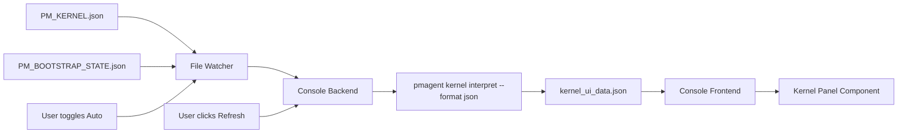

# PHASE27_C_CONSOLE_KERNEL_PANEL.md — Console V2: Kernel Panel

## Problem Statement

Console V2 exists but has no kernel awareness:
- PM must run `pmagent status handoff --json` manually
- Raw JSON requires manual parsing
- No visual cues for mode (NORMAL/DEGRADED/BLOCKED)
- Console doesn't display health or recommended actions

**Result:** Console exists but isn't kernel-driven.

---

## Objectives

Add a **Kernel Panel** to Console V2 that:

1. **Displays kernel state visually:**
   - Current phase, branch, mode
   - Health summary (green/yellow/red indicators)
   - Guard status (pass/warn/fail for each guard)
   - Recommended actions (from `pmagent kernel interpret`)

2. **Auto-updates:**
   - File watch on `PM_KERNEL.json` and `PM_BOOTSTRAP_STATE.json`
   - Manual refresh button
   - Visual indicator when data is stale

3. **Integrates with pmagent:**
   - Calls `pmagent kernel interpret --format json`
   - No manual JSON parsing in frontend
   - Backend provides UI-ready data structure

---

## UI Wireframe (Text Mockup)

```
┌─────────────────────────────────────────────────────────────┐
│ 🔧 Kernel Status                         [↻ Refresh] [Auto] │
├─────────────────────────────────────────────────────────────┤
│                                                               │
│  Phase: 26 — Kernel-First Enforcement                        │
│  Branch: main                                                 │
│  Mode: NORMAL 🟢                                              │
│  Updated: 2 minutes ago                                       │
│                                                               │
├─────────────────────────────────────────────────────────────┤
│ Health Summary                                                │
├─────────────────────────────────────────────────────────────┤
│                                                               │
│  Overall: GREEN 🟢                                            │
│                                                               │
│  Guards:                                                      │
│    ✅ Reality Green       PASS                                │
│    ✅ DMS Alignment       PASS                                │
│    ✅ Backup Fresh        PASS                                │
│    ✅ Share Sync          PASS                                │
│                                                               │
├─────────────────────────────────────────────────────────────┤
│ Allowed Actions                                               │
├─────────────────────────────────────────────────────────────┤
│                                                               │
│  ✅ Feature Work                                              │
│  ✅ OPS Blocks                                                │
│  ✅ Migrations                                                │
│  ✅ Phase Transitions                                         │
│                                                               │
├─────────────────────────────────────────────────────────────┤
│ Recommended Next Steps                                        │
├─────────────────────────────────────────────────────────────┤
│                                                               │
│  No actions required. System is healthy.                     │
│                                                               │
└─────────────────────────────────────────────────────────────┘
```

### DEGRADED Mode Example

```
┌─────────────────────────────────────────────────────────────┐
│ 🔧 Kernel Status                         [↻ Refresh] [Auto] │
├─────────────────────────────────────────────────────────────┤
│                                                               │
│  Phase: 26 — Kernel-First Enforcement                        │
│  Branch: main                                                 │
│  Mode: DEGRADED ⚠️                                            │
│  Updated: 5 seconds ago                                       │
│                                                               │
├─────────────────────────────────────────────────────────────┤
│ Health Summary                                                │
├─────────────────────────────────────────────────────────────┤
│                                                               │
│  Overall: YELLOW ⚠️                                           │
│                                                               │
│  Guards:                                                      │
│    ❌ Reality Green       FAIL (3 lint errors)                │
│    ✅ DMS Alignment       PASS                                │
│    ⚠️  Backup Fresh        WARN (last backup 25h ago)         │
│    ✅ Share Sync          PASS                                │
│                                                               │
├─────────────────────────────────────────────────────────────┤
│ Forbidden Actions                                             │
├─────────────────────────────────────────────────────────────┤
│                                                               │
│  ❌ Feature Work (remediation required first)                 │
│  ❌ Phase Transitions                                         │
│                                                               │
├─────────────────────────────────────────────────────────────┤
│ Recommended Next Steps                                        │
├─────────────────────────────────────────────────────────────┤
│                                                               │
│  1. [Run] make housekeeping                                   │
│  2. [Run] make reality.green                                  │
│  3. [Run] pmagent status handoff                              │
│                                                               │
└─────────────────────────────────────────────────────────────┘
```

---

## Data Flow Architecture



### Data Files

**Input (watched):**
- `share/handoff/PM_KERNEL.json`
- `share/handoff/PM_BOOTSTRAP_STATE.json`

**Generated (by pmagent):**
- `share/orchestrator/kernel_ui_data.json` — UI-ready kernel data

**Consumed (by Console):**
- `share/orchestrator/kernel_ui_data.json`

---

## Backend: UI Data Generator

### Command: `pmagent kernel ui-data`

```bash
pmagent kernel ui-data --output share/orchestrator/kernel_ui_data.json
```

**Output Schema:**

```json
{
  "kernel": {
    "phase": "26",
    "phase_title": "Kernel-First Enforcement & Agent Boot Automation",
    "branch": "main",
    "mode": "NORMAL",
    "mode_color": "green",
    "updated_at": "2024-12-06T15:30:00Z"
  },
  "health": {
    "overall": "green",
    "guards": [
      {"name": "Reality Green", "status": "pass", "icon": "✅"},
      {"name": "DMS Alignment", "status": "pass", "icon": "✅"},
      {"name": "Backup Fresh", "status": "pass", "icon": "✅"},
      {"name": "Share Sync", "status": "pass", "icon": "✅"}
    ]
  },
  "interpretation": {
    "allowed_actions": [
      {"label": "Feature Work", "icon": "✅"},
      {"label": "OPS Blocks", "icon": "✅"},
      {"label": "Migrations", "icon": "✅"}
    ],
    "forbidden_actions": [],
    "recommended_commands": []
  },
  "meta": {
    "generated_at": "2024-12-06T15:30:05Z",
    "pmagent_version": "0.3.0"
  }
}
```

**DEGRADED Mode Example:**

```json
{
  "kernel": {
    "phase": "26",
    "branch": "main",
    "mode": "DEGRADED",
    "mode_color": "yellow"
  },
  "health": {
    "overall": "yellow",
    "guards": [
      {"name": "Reality Green", "status": "fail", "icon": "❌", "message": "3 lint errors"},
      {"name": "Backup Fresh", "status": "warn", "icon": "⚠️", "message": "Last backup 25h ago"}
    ]
  },
  "interpretation": {
    "allowed_actions": [{"label": "Remediation", "icon": "🔧"}],
    "forbidden_actions": [
      {"label": "Feature Work", "icon": "❌", "reason": "System degraded"}
    ],
    "recommended_commands": [
      {"label": "make housekeeping", "runnable": true},
      {"label": "make reality.green", "runnable": true}
    ]
  }
}
```

---

## Frontend: Kernel Panel Component

### Component Structure

```
webui/orchestrator-console-v2/src/
  components/
    KernelPanel.tsx          # Main panel component
    KernelStatus.tsx         # Phase/branch/mode display
    HealthSummary.tsx        # Guard status grid
    ActionsList.tsx          # Allowed/forbidden actions
    RecommendedSteps.tsx     # Command buttons
```

### Main Component (`KernelPanel.tsx`)

```typescript
import React, { useState, useEffect } from 'react';
import { KernelStatus } from './KernelStatus';
import { HealthSummary } from './HealthSummary';
import { ActionsList } from './ActionsList';
import { RecommendedSteps } from './RecommendedSteps';

interface KernelUIData {
  kernel: {
    phase: string;
    phase_title: string;
    branch: string;
    mode: 'NORMAL' | 'DEGRADED' | 'BLOCKED';
    mode_color: 'green' | 'yellow' | 'red';
    updated_at: string;
  };
  health: {
    overall: 'green' | 'yellow' | 'red';
    guards: Array<{
      name: string;
      status: 'pass' | 'warn' | 'fail';
      icon: string;
      message?: string;
    }>;
  };
  interpretation: {
    allowed_actions: Array<{ label: string; icon: string }>;
    forbidden_actions: Array<{ label: string; icon: string; reason?: string }>;
    recommended_commands: Array<{ label: string; runnable: boolean }>;
  };
}

export const KernelPanel: React.FC = () => {
  const [data, setData] = useState<KernelUIData | null>(null);
  const [autoRefresh, setAutoRefresh] = useState(false);

  const fetchKernelData = async () => {
    const response = await fetch('/share/orchestrator/kernel_ui_data.json');
    const json = await response.json();
    setData(json);
  };

  useEffect(() => {
    fetchKernelData();
  }, []);

  useEffect(() => {
    if (autoRefresh) {
      const interval = setInterval(fetchKernelData, 10000); // 10s
      return () => clearInterval(interval);
    }
  }, [autoRefresh]);

  if (!data) return <div>Loading kernel status...</div>;

  return (
    <div className="kernel-panel">
      <div className="kernel-panel-header">
        <h2>🔧 Kernel Status</h2>
        <button onClick={fetchKernelData}>↻ Refresh</button>
        <label>
          <input
            type="checkbox"
            checked={autoRefresh}
            onChange={(e) => setAutoRefresh(e.target.checked)}
          />
          Auto
        </label>
      </div>

      <KernelStatus kernel={data.kernel} />
      <HealthSummary health={data.health} />
      <ActionsList
        allowed={data.interpretation.allowed_actions}
        forbidden={data.interpretation.forbidden_actions}
      />
      <RecommendedSteps commands={data.interpretation.recommended_commands} />
    </div>
  );
};
```

---

## Styling

### Mode Color Coding

```css
.kernel-panel {
  border: 2px solid var(--border-color);
  border-radius: 8px;
  padding: 16px;
}

.mode-badge {
  padding: 4px 12px;
  border-radius: 4px;
  font-weight: bold;
}

.mode-badge.normal {
  background-color: #d4edda;
  color: #155724;
  border: 1px solid #c3e6cb;
}

.mode-badge.degraded {
  background-color: #fff3cd;
  color: #856404;
  border: 1px solid #ffeaa7;
}

.mode-badge.blocked {
  background-color: #f8d7da;
  color: #721c24;
  border: 1px solid #f5c6cb;
}

.guard-status {
  display: flex;
  align-items: center;
  gap: 8px;
  padding: 4px 0;
}

.guard-status.pass { color: #28a745; }
.guard-status.warn { color: #ffc107; }
.guard-status.fail { color: #dc3545; }
```

---

## Auto-Refresh Mechanism

### File Watch (Optional for Phase 27)

If implementing file watch:

```typescript
// Backend: Node.js file watcher
import chokidar from 'chokidar';

const watcher = chokidar.watch([
  'share/handoff/PM_KERNEL.json',
  'share/handoff/PM_BOOTSTRAP_STATE.json'
]);

watcher.on('change', (path) => {
  console.log(`File changed: ${path}`);
  exec('pmagent kernel ui-data --output share/orchestrator/kernel_ui_data.json');
  // Notify frontend via WebSocket or Server-Sent Events
});
```

**Phase 27 Recommendation:** Manual refresh only. Defer file watch to Phase 28.

---

## Integration with Console V2 Schema

### Updated `CONSOLE_SCHEMA.json`

```json
{
  "regions": {
    "right_status": {
      "tiles": [
        {
          "id": "kernel_panel",
          "label": "Kernel Status",
          "component": "KernelPanel",
          "data_source": "share/orchestrator/kernel_ui_data.json",
          "auto_refresh": false
        }
      ]
    }
  }
}
```

### Updated `VIEW_MODEL.json`

```json
{
  "data_bindings": {
    "kernel_ui_data": {
      "path": "share/orchestrator/kernel_ui_data.json",
      "schema": "KernelUIData",
      "generated_by": "pmagent kernel ui-data"
    }
  }
}
```

---

## Implementation Plan

### Phase 1: Backend (pmagent)

1. Create `pmagent/kernel/ui_data.py` — UI data generator
2. Add CLI command: `pmagent kernel ui-data`
3. Test: generate `kernel_ui_data.json`, verify schema

### Phase 2: Frontend (Console V2)

1. Create `KernelPanel.tsx` + sub-components
2. Wire data fetch from `kernel_ui_data.json`
3. Add styling (mode badges, guard icons)
4. Test: display kernel status in Console

### Phase 3: Integration

1. Update `CONSOLE_SCHEMA.json` and `VIEW_MODEL.json`
2. Add Kernel Panel to Console right status region
3. Manual verification: screenshot walkthrough

---

## Testing Strategy

### Test Vectors

**TV-27C-01: Display NORMAL Mode**
- Setup: `PM_KERNEL.json` with mode=NORMAL, all guards green
- Expected: Green badge, all guards show ✅, allowed actions listed

**TV-27C-02: Display DEGRADED Mode**
- Setup: `PM_KERNEL.json` with mode=DEGRADED, reality.green failed
- Expected: Yellow badge, failed guard shows ❌, recommended commands displayed

**TV-27C-03: Manual Refresh**
- Setup: User clicks refresh button
- Expected: Data reloads, updated timestamp shown

**TV-27C-04: Auto-Refresh Toggle (if implemented)**
- Setup: User toggles auto-refresh on
- Expected: Data refreshes every 10s

### Manual Verification

1. Run Console V2: `cd webui/orchestrator-console-v2 && npm run dev`
2. Verify Kernel Panel appears in right status region
3. Verify mode badge color matches kernel state
4. Verify guard status icons and messages display correctly
5. Screenshot walkthrough: capture NORMAL and DEGRADED states

---

## Success Criteria

27.C is DONE when:

1. ✅ `pmagent kernel ui-data` command generates UI-ready JSON
2. ✅ Kernel Panel component displays in Console V2
3. ✅ Mode badges (green/yellow/red) render correctly
4. ✅ Guard status grid shows pass/warn/fail with icons
5. ✅ Allowed/forbidden actions listed accurately
6. ✅ Recommended commands displayed (buttons optional for Phase 27)
7. ✅ Manual refresh button works
8. ✅ Screenshot walkthrough in `walkthrough.md`

---

## Deferred to Phase 28+

- Auto-refresh via file watch (manual refresh only for Phase 27)
- Runnable command buttons (clickable commands that execute in terminal)
- WebSocket/SSE for real-time updates
- Historical kernel state timeline

---

## Open Questions for PM

1. **Auto-Refresh:**
   - File watch for Phase 27, or manual refresh only?
   - Recommendation: Manual refresh for Phase 27.

2. **Command Buttons:**
   - Should recommended commands be clickable (execute in terminal)?
   - Recommendation: Display only for Phase 27, clickable in Phase 28.

3. **Console Placement:**
   - Kernel Panel in right status region, or create dedicated top banner?
   - Recommendation: Right status region for Phase 27.

---

## Dependencies

- Phase 27.A: `pmagent kernel interpret` exists
- Console V2 architecture (React + TypeScript)
- `CONSOLE_SCHEMA.json` and `VIEW_MODEL.json` patterns established

---

## PM Approval Required

Before implementation:
- PM reviews UI wireframe
- PM approves data schema (`kernel_ui_data.json`)
- PM confirms manual refresh is acceptable (no file watch)
- PM resolves Console placement question
