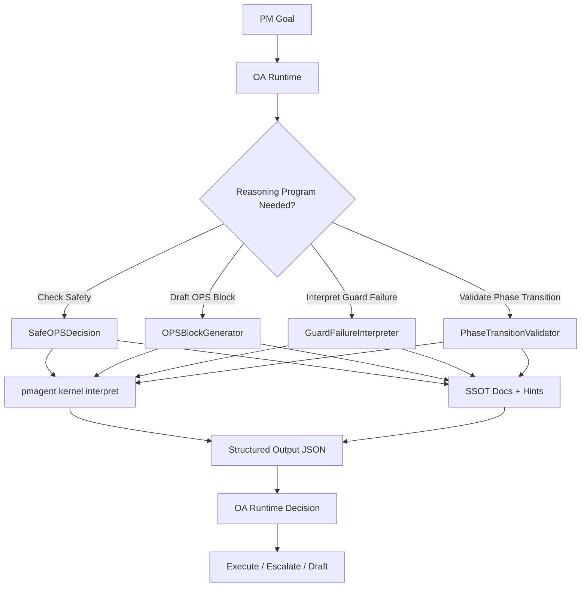

# PHASE27_D_DSPY_REASONING_OUTLINE.md — DSPy Reasoning Programs (Design Only)

## Problem Statement

Currently, reasoning is ad-hoc and manual:
- PM manually decides "is this OPS work safe?"
- Cursor receives freestyle prompts, not structured reasoning
- No formal reasoning programs that encode decisions like:
  - "How to draft an OPS block from a PM goal"
  - "How to interpret guard failures"
  - "How to validate phase transitions"
- DSPy is installed but underutilized

**Result:** Reasoning is tribal knowledge, not codified.

---

## Objectives

**Phase 27.D Scope: Design Only**

1. **Outline 4 core reasoning programs:**
   - Safe OPS Decision
   - OPS Block Generator
   - Guard Failure Interpreter
   - Phase Transition Validator

2. **Define integration architecture:**
   - DSPy programs call `pmagent` as tools
   - Programs use SSOT docs + hints as few-shot examples
   - Programs output structured JSON (not prose)

3. **Establish Phase 28+ roadmap:**
   - Which programs to implement first
   - How to test reasoning programs
   - How to integrate with OA runtime

**No Implementation in Phase 27** — Design and architecture only.

---

## Reasoning Program 1: Safe OPS Decision

### Purpose

Given kernel state + proposed OPS work, return go/no-go decision with rationale.

### Signature

```python
class SafeOPSDecision(dspy.Signature):
    """
    Decide if proposed OPS work is safe given current kernel state.
    """
    kernel_state: KernelInterpretation = dspy.InputField(
        desc="Current kernel mode, health, allowed/forbidden actions"
    )
    proposed_ops: str = dspy.InputField(
        desc="Description of proposed OPS work (e.g., 'migrate schema', 'add new phase')"
    )
    
    decision: Literal["GO", "NO_GO", "CONDITIONAL"] = dspy.OutputField(
        desc="GO = safe to proceed, NO_GO = forbidden, CONDITIONAL = requires PM override"
    )
    rationale: str = dspy.OutputField(
        desc="Explanation of decision based on kernel state and OPS contract rules"
    )
    required_guards: list[str] = dspy.OutputField(
        desc="Guards that must pass before proceeding (if CONDITIONAL)"
    )
```

### Example Input/Output

**Input:**
```json
{
  "kernel_state": {
    "mode": "DEGRADED",
    "health": {"overall": "yellow"},
    "interpretation": {
      "allowed_actions": ["remediation"],
      "forbidden_actions": ["feature_work", "migrations"]
    }
  },
  "proposed_ops": "Add new migration: create table control.phase27_logs"
}
```

**Output:**
```json
{
  "decision": "NO_GO",
  "rationale": "Kernel mode is DEGRADED. Rule 050 forbids migrations when mode != NORMAL. Proposed work involves schema changes, which are classified as 'migrations' per OPS contract.",
  "required_guards": ["reality.green", "dms_alignment"]
}
```

### Integration Points

- OA calls `SafeOPSDecision` before drafting OPS blocks
- Cursor calls `SafeOPSDecision` before executing destructive commands
- PM queries `SafeOPSDecision` when considering manual overrides

---

## Reasoning Program 2: OPS Block Generator

### Purpose

Given PM goal + kernel state, generate a complete, executable OPS block.

### Signature

```python
class OPSBlockGenerator(dspy.Signature):
    """
    Generate a complete OPS block from PM goal and kernel state.
    """
    pm_goal: str = dspy.InputField(
        desc="PM's stated goal (e.g., 'Implement Phase 27.A kernel interpreter')"
    )
    kernel_state: KernelInterpretation = dspy.InputField(
        desc="Current kernel mode, phase, health"
    )
    relevant_ssot_docs: list[str] = dspy.InputField(
        desc="SSOT doc paths relevant to the goal (e.g., PHASE27_A spec)"
    )
    hints: list[str] = dspy.InputField(
        desc="Hints from registry relevant to the goal"
    )
    
    ops_block: str = dspy.OutputField(
        desc="Complete OPS block in markdown format, following OPS contract template"
    )
    confidence: float = dspy.OutputField(
        desc="Confidence score 0.0-1.0 that OPS block is correct and complete"
    )
```

### Example Input/Output

**Input:**
```json
{
  "pm_goal": "Implement Phase 27.A kernel interpreter",
  "kernel_state": {"mode": "NORMAL", "phase": "26"},
  "relevant_ssot_docs": ["docs/SSOT/PHASE27_A_PMAGENT_KERNEL_INTERPRETER.md"],
  "hints": ["pmagent.kernel.commands", "pmagent.boot.kernel_first"]
}
```

**Output:**
```markdown
## 🟦 OPS MODE — Implement Phase 27.A Kernel Interpreter

**Governance:** Gemantria OPS v6.2.3 (tool-aware, 050 + 051 + 052 active)

## Goal

Implement `pmagent kernel interpret` command per PHASE27_A spec.

## Preflight

Source: PHASE27_A_PMAGENT_KERNEL_INTERPRETER.md

### Kernel Status
- Phase: 26
- Branch: main
- Mode: NORMAL ✅
- Health: GREEN ✅

### Guards Required
- [x] `make reality.green`
- [x] `make ops.kernel.check`

## Commands

```bash
# 1. Create interpreter module
touch pmagent/kernel/interpreter.py

# 2. Implement core logic
# (Cursor: implement interpret_kernel() per spec)

# 3. Add CLI command
# (Cursor: wire 'pmagent kernel interpret' in cli.py)

# 4. Test
pytest tests/pmagent/kernel/test_interpreter.py -v
```

## Evidence to Return

1. Output of pytest showing TV-27A-01 through TV-27A-04 passing
2. `pmagent kernel interpret --format json` sample output
3. `pmagent kernel interpret --format human` sample output

## Next Gate

If tests pass:
- Update task.md: mark 27.A implementation complete
- Proceed to 27.B (OA runtime)

If tests fail:
- Review failures with PM
- Revise implementation
```

**Confidence:** `0.85`

### Integration Points

- OA runtime uses `OPSBlockGenerator` to draft blocks for PM review
- PM can manually trigger `OPSBlockGenerator` for complex goals
- LM Studio tool belt exposes `OPSBlockGenerator` as `draft_ops_block()`

---

## Reasoning Program 3: Guard Failure Interpreter

### Purpose

Given guard output, return human-readable diagnosis + remediation steps.

### Signature

```python
class GuardFailureInterpreter(dspy.Signature):
    """
    Interpret guard failure output and recommend remediation.
    """
    guard_name: str = dspy.InputField(
        desc="Name of failed guard (e.g., 'reality.green', 'dms_alignment')"
    )
    guard_output: str = dspy.InputField(
        desc="Raw output from guard script (stdout + stderr)"
    )
    kernel_state: KernelInterpretation = dspy.InputField(
        desc="Current kernel state for context"
    )
    
    diagnosis: str = dspy.OutputField(
        desc="Human-readable explanation of what went wrong"
    )
    root_cause: str = dspy.OutputField(
        desc="Likely root cause (e.g., 'lint errors in pmagent/', 'missing hint entries')"
    )
    remediation_steps: list[str] = dspy.OutputField(
        desc="Ordered list of commands to fix the issue"
    )
    estimated_time: str = dspy.OutputField(
        desc="Estimated time to remediate (e.g., '5 minutes', '1 hour')"
    )
```

### Example Input/Output

**Input:**
```json
{
  "guard_name": "reality.green",
  "guard_output": "FAIL: ruff check found 3 errors in pmagent/kernel/interpreter.py\nFAIL: Missing hint: pmagent.kernel.interpret",
  "kernel_state": {"mode": "DEGRADED", "health": {"overall": "yellow"}}
}
```

**Output:**
```json
{
  "diagnosis": "reality.green failed due to code quality and missing hint issues.",
  "root_cause": "1. Ruff linter found 3 errors in pmagent/kernel/interpreter.py. 2. Hint 'pmagent.kernel.interpret' not registered in control.hint_registry.",
  "remediation_steps": [
    "ruff check --fix pmagent/kernel/interpreter.py",
    "Review remaining lint errors manually",
    "Add hint 'pmagent.kernel.interpret' to control.hint_registry via pmagent cli",
    "make reality.green"
  ],
  "estimated_time": "10 minutes"
}
```

### Integration Points

- OA calls `GuardFailureInterpreter` when Cursor reports guard failure
- Console Kernel Panel displays interpreted failures (not raw output)
- PM escalates to `GuardFailureInterpreter` for complex failures

---

## Reasoning Program 4: Phase Transition Validator

### Purpose

Given current phase + proposed next phase, validate transition is allowed.

### Signature

```python
class PhaseTransitionValidator(dspy.Signature):
    """
    Validate if transitioning from current phase to proposed phase is allowed.
    """
    current_phase: str = dspy.InputField(
        desc="Current phase number (e.g., '26')"
    )
    proposed_phase: str = dspy.InputField(
        desc="Proposed next phase number (e.g., '27')"
    )
    kernel_state: KernelInterpretation = dspy.InputField(
        desc="Current kernel state"
    )
    phase_done_checklist: dict = dspy.InputField(
        desc="Phase-DONE criteria for current phase"
    )
    
    allowed: bool = dspy.OutputField(
        desc="True if transition is allowed, False otherwise"
    )
    blockers: list[str] = dspy.OutputField(
        desc="Items blocking transition (if allowed=False)"
    )
    recommendations: list[str] = dspy.OutputField(
        desc="Recommended actions before proceeding"
    )
```

### Example Input/Output

**Input:**
```json
{
  "current_phase": "26",
  "proposed_phase": "27",
  "kernel_state": {"mode": "NORMAL"},
  "phase_done_checklist": {
    "kernel_bundle_generated": true,
    "hints_updated": true,
    "pmagent_commands_implemented": true,
    "oa_ops_grounding_complete": false,
    "reality_green_passes": true
  }
}
```

**Output:**
```json
{
  "allowed": false,
  "blockers": [
    "Phase 26 criterion 'oa_ops_grounding_complete' is not satisfied"
  ],
  "recommendations": [
    "Complete Phase 26 OA/OPS boot spec documentation",
    "Update PHASE26_INDEX.md to mark 26.C and 26.D complete",
    "Re-run phase-done validation: pmagent phase validate-done 26"
  ]
}
```

### Integration Points

- PM calls `PhaseTransitionValidator` before updating `PM_KERNEL.json` to new phase
- OA refuses to draft "Phase 27 kickoff" OPS block if validator returns `allowed=False`
- CI/CD pipeline runs `PhaseTransitionValidator` before merging phase transitions

---

## Integration Architecture



### Data Flow

1. **PM** provides goal to OA Runtime
2. **OA Runtime** selects appropriate reasoning program
3. **Reasoning Program** calls:
   - `pmagent` tools (e.g., `kernel interpret`)
   - SSOT doc retrieval
   - Hints registry queries
4. **Reasoning Program** outputs structured JSON
5. **OA Runtime** interprets output and acts (execute, escalate, or draft)

---

## DSPy Implementation Details (Phase 28+)

### Few-Shot Examples Source

Reasoning programs use SSOT docs as few-shot examples:

- **SafeOPSDecision**: Use `EXECUTION_CONTRACT_CURSOR.md` + Rule 050 examples
- **OPSBlockGenerator**: Use past OPS blocks from conversation history (if available)
- **GuardFailureInterpreter**: Use `GOTCHAS_INDEX.md` + guard script docstrings
- **PhaseTransitionValidator**: Use `PHASE*_INDEX.md` phase-done checklists

### DSPy Modules

```python
# Example minimal DSPy module for SafeOPSDecision

import dspy

class SafeOPSDecisionModule(dspy.Module):
    def __init__(self):
        super().__init__()
        self.predictor = dspy.ChainOfThought(SafeOPSDecision)
    
    def forward(self, kernel_state, proposed_ops):
        return self.predictor(
            kernel_state=kernel_state,
            proposed_ops=proposed_ops
        )

# Usage:
safe_ops = SafeOPSDecisionModule()
result = safe_ops(
    kernel_state={"mode": "NORMAL", ...},
    proposed_ops="Add new migration"
)
print(result.decision, result.rationale)
```

### Compilation & Optimization

DSPy programs can be compiled/optimized in Phase 28+:

```python
from dspy.teleprompt import BootstrapFewShot

# Define metric: correct decision + clear rationale
def metric(example, prediction):
    return (
        prediction.decision in ["GO", "NO_GO", "CONDITIONAL"]
        and len(prediction.rationale) > 50
    )

# Compile program with few-shot examples from SSOT docs
teleprompter = BootstrapFewShot(metric=metric)
compiled_safe_ops = teleprompter.compile(
    SafeOPSDecisionModule(),
    trainset=load_ssot_examples()
)
```

---

## Phase 28+ Implementation Roadmap

### Priority Order

1. **Phase 28.A:** Implement `SafeOPSDecision` (highest immediate value)
2. **Phase 28.B:** Implement `GuardFailureInterpreter`
3. **Phase 28.C:** Implement `OPSBlockGenerator`
4. **Phase 28.D:** Implement `PhaseTransitionValidator`

### Testing Strategy

For each reasoning program:

1. **Unit tests:** Test signature inputs/outputs with mock data
2. **Integration tests:** Test program calling real `pmagent` commands
3. **Evaluation set:** Curate 10-20 real scenarios from past OPS work
4. **Metrics:**
   - Accuracy: % of correct decisions
   - Latency: Response time
   - Explanation quality: Human rating of rationale clarity

### Success Metrics

Phase 28 succeeds if:

- **SafeOPSDecision** achieves ≥90% accuracy on evaluation set
- **GuardFailureInterpreter** generates actionable remediation steps
- **OPSBlockGenerator** produces valid OPS blocks (PM approval rate ≥80%)
- **PhaseTransitionValidator** catches phase-done violations

---

## Success Criteria (Phase 27.D Design Only)

27.D is DONE when:

1. ✅ Four reasoning program signatures defined
2. ✅ I/O schemas documented with examples
3. ✅ Integration architecture diagrammed
4. ✅ Phase 28+ roadmap outlined
5. ✅ This spec merged to `docs/SSOT/`
6. ✅ `AGENTS.md` updated with "Future DSPy Reasoning Layer" section

**No Implementation Required** for Phase 27.D.

---

## Open Questions for PM

1. **Example Curation:**
   - Should Phase 27.D include curated few-shot examples from past conversations?
   - Recommendation: Defer to Phase 28; Phase 27.D is design only.

2. **DSPy Model Selection:**
   - Which LLM should power DSPy programs? (OpenAI GPT-4, local Llama, etc.)
   - Recommendation: Decide in Phase 28 based on cost/latency trade-offs.

3. **OA Runtime Integration:**
   - Should OA automatically call reasoning programs, or require explicit PM trigger?
   - Recommendation: Automatic for `SafeOPSDecision`, manual for others (Phase 28).

---

## Dependencies

- Phase 27.A: `pmagent kernel interpret` provides kernel state to reasoning programs
- Phase 27.B: OA runtime will consume reasoning program outputs
- SSOT docs: Reasoning programs use SSOT docs as few-shot examples
- Hints registry: Reasoning programs query hints for command suggestions

---

## PM Approval Required

Before proceeding to Phase 28:
- PM reviews this design spec
- PM approves priority order for implementation
- PM confirms evaluation strategy is acceptable
- PM resolves open questions (example curation, model selection, OA integration)
