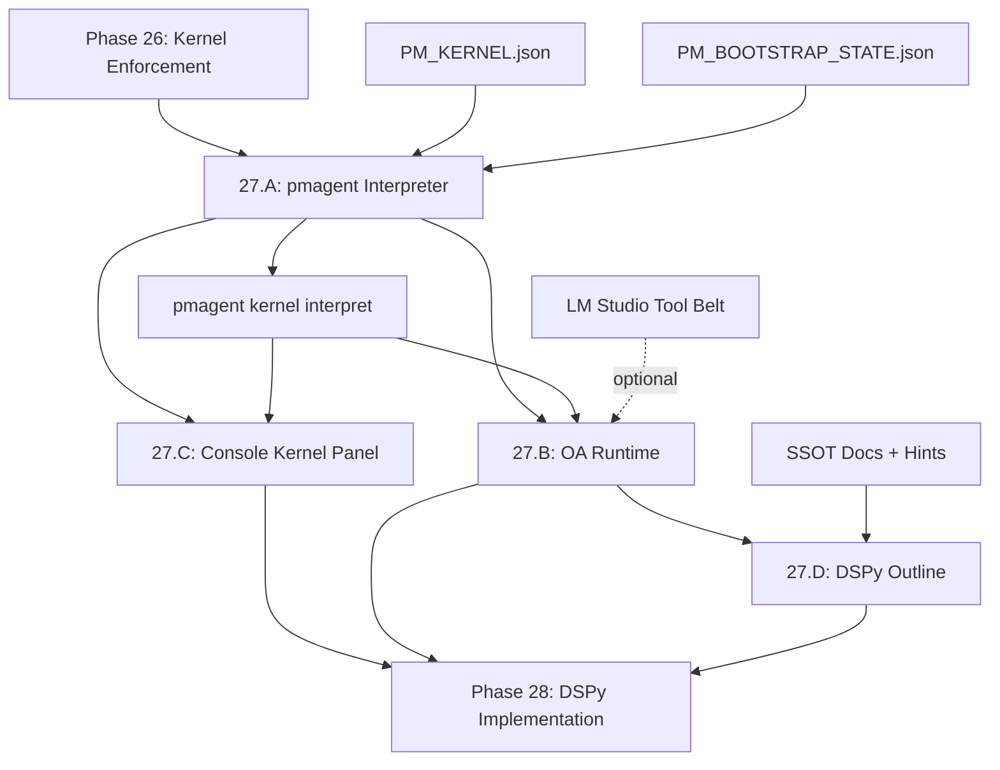

# PHASE27_INDEX.md — Kernel Consumers & OA Runtime

## 27.0 — Phase Summary

**Goal:** Transform the kernel from a "data surface" into an active runtime contract that drives agent behavior. Move primary reasoning and orchestration logic from Cursor+PM chat into pmagent/OA/Console components.

**Core Transition:**
- Phase 26: **Enforcement** — "Kernel exists and must be checked"
- Phase 27: **Consumption** — "Kernel drives behavior and decisions"

**Scope:**
- In-scope:
  - pmagent as the default kernel interpreter (not just data loader)
  - Minimal OA runtime that consumes kernel and drafts OPS blocks
  - Console V2 Kernel Panel that displays kernel state visually
  - Initial outline of DSPy reasoning programs to replace ad-hoc Cursor reasoning
- Out of scope:
  - Full DSPy implementation (Phase 28+)
  - Complete Console V2 redesign (incremental only)
  - Deprecating Cursor entirely (still executor, just less inventor)

**Prereqs:**
- Phase 26: Kernel-first boot enforcement is complete and live
  - Rule 050 Section 0 mandates `make ops.kernel.check`
  - README banner declares governed system
  - START_HERE.md provides canonical boot path
  - `guard_kernel_boot.py` and `make ops.kernel.check` are operational

---

## 27.A — pmagent as Default Kernel Interpreter

### Problem

Currently:
- `pmagent` loads kernel data but doesn't interpret mode semantics
- PM (human) manually interprets `mode: NORMAL` vs `mode: DEGRADED`
- Cursor receives kernel status but doesn't derive behavior from it
- No single source of truth for "what should I do given this kernel state?"

### Objectives

1. **Kernel Interpretation API:**
   - `pmagent kernel interpret` — Returns actionable directives based on kernel state
   - Inputs: `PM_KERNEL.json` + `PM_BOOTSTRAP_STATE.json`
   - Outputs: structured recommendations (remediation commands, feature work permissions, escalation triggers)

2. **Mode Semantics Enforcement:**
   - NORMAL mode → "Feature work allowed, proceed with OPS blocks"
   - DEGRADED mode → "Remediation only, NO feature work without explicit PM override"
   - BLOCKED mode (new) → "Emergency mode, only diagnostic commands allowed"

3. **Integration Points:**
   - `make ops.kernel.check` now calls `pmagent kernel interpret`
   - OA boot sequence queries `pmagent kernel interpret` first
   - Console UI displays interpretation results (not raw JSON)

### Deliverables

- **Design Spec**: [`PHASE27_A_PMAGENT_KERNEL_INTERPRETER.md`](docs/SSOT/PHASE27_A_PMAGENT_KERNEL_INTERPRETER.md)
  - Command design for `pmagent kernel interpret`
  - Mode semantics matrix (NORMAL/DEGRADED/BLOCKED × agent roles)
  - Output schema for interpretation results
  - Integration with existing boot commands
- **Implementation**:
  - `pmagent/kernel/interpreter.py` — Core interpretation logic
  - CLI command wiring in `pmagent/cli.py`
  - Updated `guard_kernel_boot.py` to use interpreter
- **Tests**:
  - Test vectors for each mode × health state combination
  - Integration with `make reality.green`

---

## 27.B — Minimal OA Runtime

### Problem

Currently:
- OA (Orchestrator Assistant) is just "PM asking questions to an LLM"
- No formal OA runtime that:
  - Boots from kernel
  - Interprets mode
  - Drafts OPS blocks for Cursor
  - Tracks execution state
- PM is still manually orchestrating Cursor, not OA

### Objectives

1. **OA Runtime Bootstrap:**
   - OA starts by calling `pmagent boot oa` (or `pmagent kernel interpret`)
   - Receives kernel state + interpretation + allowed actions
   - Surfaces mode to LM Studio / PM chat interface

2. **OPS Block Drafting:**
   - OA drafts OPS blocks based on kernel state and PM goals
   - OA does NOT execute — it drafts for Cursor to execute
   - OPS blocks include:
     - Goal statement
     - Commands (sourced from pmagent/hints/SSOT)
     - Evidence requirements
     - Success criteria

3. **State Tracking:**
   - OA maintains session state: "last kernel read", "mode at boot", "pending OPS blocks"
   - OA warns if mode has drifted since boot
   - OA escalates if Cursor reports guard failures

### Deliverables

- **Design Spec**: [`PHASE27_B_OA_RUNTIME.md`](docs/SSOT/PHASE27_B_OA_RUNTIME.md)
  - OA runtime boot sequence (kernel → interpret → mode check)
  - OPS block drafting protocol
  - State tracking mechanism (in-memory or DMS-backed)
  - Integration with LM Studio tool belt (if applicable)
  - Escalation patterns (degraded mode, guard failures, Cursor refusals)
- **Implementation (Minimal)**:
  - `pmagent/oa/runtime.py` — Basic OA runtime state machine
  - `pmagent/oa/drafting.py` — OPS block template generator
  - Tool belt wrappers for LM Studio (if ready)
- **Tests**:
  - Boot sequence in NORMAL vs DEGRADED mode
  - OPS block drafting from example PM goals
  - State tracking across simulated sessions

---

## 27.C — Console V2: Kernel Panel

### Problem

Currently:
- Console V2 exists but has no kernel awareness
- PM must run `pmagent status handoff --json` manually and read JSON
- No visual representation of kernel state, mode, or health
- Console doesn't guide PM on "what should I do next?"

### Objectives

1. **Kernel Panel Component:**
   - Displays:
     - Current phase
     - Current branch
     - Mode (NORMAL/DEGRADED/BLOCKED) with color coding
     - Health summary (guards status, DMS alignment, backup freshness)
     - Recommended next actions (from `pmagent kernel interpret`)
   - Auto-refreshes on file watch or manual trigger

2. **Integration with `pmagent`:**
   - Kernel Panel calls `pmagent status handoff --json` on load
   - Displays interpretation from `pmagent kernel interpret`
   - No manual JSON parsing in frontend — backend provides UI-ready data

3. **Incremental Console V2 Update:**
   - Add Kernel Panel as new tile in right_status region
   - Reuse existing Console V2 architecture (React + TypeScript)
   - No full redesign — just one new panel

### Deliverables

- **Design Spec**: [`PHASE27_C_CONSOLE_KERNEL_PANEL.md`](docs/SSOT/PHASE27_C_CONSOLE_KERNEL_PANEL.md)
  - Kernel Panel UI wireframe (text-based mockup)
  - Data flow: `pmagent` → JSON → Console UI
  - Styling: mode color coding, health icons, action buttons
  - File watch integration for auto-refresh
- **Implementation**:
  - `webui/orchestrator-console-v2/src/components/KernelPanel.tsx`
  - Updated `CONSOLE_SCHEMA.json` and `VIEW_MODEL.json` to include kernel tile
  - Backend helper: `share/orchestrator/kernel_ui_data.json` (generated by pmagent)
- **Tests**:
  - Manual verification: run Console, check Kernel Panel displays correctly
  - Screenshot walkthrough in walkthrough.md

---

## 27.D — DSPy Reasoning Programs Outline

### Problem

Currently:
- Most reasoning is ad-hoc prompting in Cursor or PM chat
- No formal "reasoning programs" that encode:
  - "How to decide if OPS work is safe"
  - "How to draft an OPS block from a PM goal"
  - "How to interpret guard failures and recommend remediation"
- DSPy is installed but underutilized

### Objectives

1. **Outline Reasoning Programs:**
   - **Program 1: Safe OPS Decision** — Given kernel state + proposed OPS work, return go/no-go + rationale
   - **Program 2: OPS Block Generator** — Given PM goal + kernel state, generate complete OPS block
   - **Program 3: Guard Failure Interpreter** — Given guard output, return human-readable diagnosis + remediation steps
   - **Program 4: Phase Transition Validator** — Given current phase + proposed next phase, validate transition is allowed

2. **DSPy Integration Points:**
   - Programs call `pmagent` as tools (not replace pmagent)
   - Programs use SSOT docs + hints as few-shot examples
   - Programs output structured data (JSON), not just prose

3. **Phase 27 Scope:**
   - **Design only** — outline program signatures, inputs/outputs, example flows
   - **No implementation** — defer to Phase 28+
   - Goal: establish the roadmap for moving reasoning out of Cursor

### Deliverables

- **Design Spec**: [`PHASE27_D_DSPY_REASONING_OUTLINE.md`](docs/SSOT/PHASE27_D_DSPY_REASONING_OUTLINE.md)
  - Four reasoning program outlines (signatures + I/O schemas)
  - Integration architecture: DSPy ↔ pmagent ↔ SSOT/hints
  - Example flow diagrams (text-based or Mermaid)
  - Phase 28+ roadmap for implementation
- **No Implementation** in Phase 27
- **Documentation Only**:
  - Update `AGENTS.md` with "future DSPy reasoning layer" section
  - Link from OA runtime spec (27.B) to DSPy outline (27.D)

---

## 27.E — Phase-DONE Criteria

Phase 27 is DONE when:

1. ✅ **27.A Complete:**
   - `pmagent kernel interpret` command exists and returns actionable directives
   - `make ops.kernel.check` uses interpreter
   - Test vectors pass for NORMAL/DEGRADED/BLOCKED modes

2. ✅ **27.B Complete (Minimal):**
   - OA boot sequence documented and optionally prototyped
   - OPS block drafting protocol specified
   - OA runtime design approved by PM

3. ✅ **27.C Complete:**
   - Console V2 Kernel Panel implemented
   - Panel displays kernel state + mode + health
   - Screenshot walkthrough in walkthrough.md

4. ✅ **27.D Complete:**
   - DSPy reasoning programs outlined (design only)
   - Integration architecture documented
   - Phase 28+ roadmap clear

5. ✅ **Guards Green:**
   - `make reality.green` passes
   - No new lint errors
   - DMS alignment maintained

6. ✅ **Documentation Updated:**
   - `PHASE27_INDEX.md` merged to main
   - All four sub-specs (27.A–27.D) in `docs/SSOT/`
   - `AGENTS.md` references kernel interpreter + OA runtime
   - `README.md` updated to mention kernel consumers (if relevant)

---

## 27.F — Deferred to Phase 28+

Explicitly OUT of scope for Phase 27:

- Full DSPy implementation (27.D is design only)
- Complete OA runtime with state persistence (27.B is minimal prototype)
- Full Console V2 redesign (27.C is one panel only)
- Deprecating Cursor entirely (Cursor remains executor)
- Multi-mode kernel formats (Phase 26 format is stable)
- Pre-commit hooks for kernel checks (enforcement via guards is sufficient)

---

## 27.G — Open Questions for PM Review

1. **LM Studio Integration:**
   - Should 27.B include LM Studio tool belt wrappers, or is that Phase 28+?
   - If included, does PM have LM Studio environment ready for testing?

2. **OA Runtime State:**
   - In-memory session state (ephemeral), or DMS-backed state (persistent)?
   - Recommendation: start with in-memory, defer DMS backing to Phase 28.

3. **Console V2 Auto-Refresh:**
   - File watch on `PM_KERNEL.json` + `PM_BOOTSTRAP_STATE.json`?
   - Or manual refresh button only?
   - Recommendation: manual button for Phase 27, file watch in Phase 28.

4. **DSPy Example Scope:**
   - Should 27.D include a single "hello world" DSPy program, or remain fully design-only?
   - Recommendation: design-only to avoid scope creep.

---

## 27.H — Dependencies & Integration Map

---

## 27.I — Success Metrics

Phase 27 succeeds if:

- **PM no longer manually interprets kernel JSON** — Console Panel shows interpretation
- **OA can draft OPS blocks** — even if minimal, the pattern is established
- **Cursor starts from kernel interpretation** — not from "what does PM want?"
- **Roadmap to DSPy is clear** — Phase 28+ knows what to implement

Phase 27 fails if:

- pmagent interpreter just dumps JSON (no interpretation)
- OA runtime is vaporware (no spec, no prototype)
- Console Panel is just another JSON viewer
- DSPy outline is hand-wavy (no concrete program signatures)

---

## 27.J — PM Approval Gate

**Before starting Phase 27 implementation:**

1. PM reviews this index + 4 sub-specs
2. PM approves or requests revisions
3. PM confirms:
   - Scope is appropriate (not too big, not too small)
   - Deliverables are testable
   - Deferred items (27.F) are acceptable
   - Open questions (27.G) are resolved

**After PM approval:**

- Create `PHASE27_INDEX.md` in `docs/SSOT/`
- Create 4 sub-specs in `docs/SSOT/`
- Update `PM_KERNEL.json` to phase 27
- Begin implementation in small PRs (27.A → 27.B → 27.C → 27.D design)
