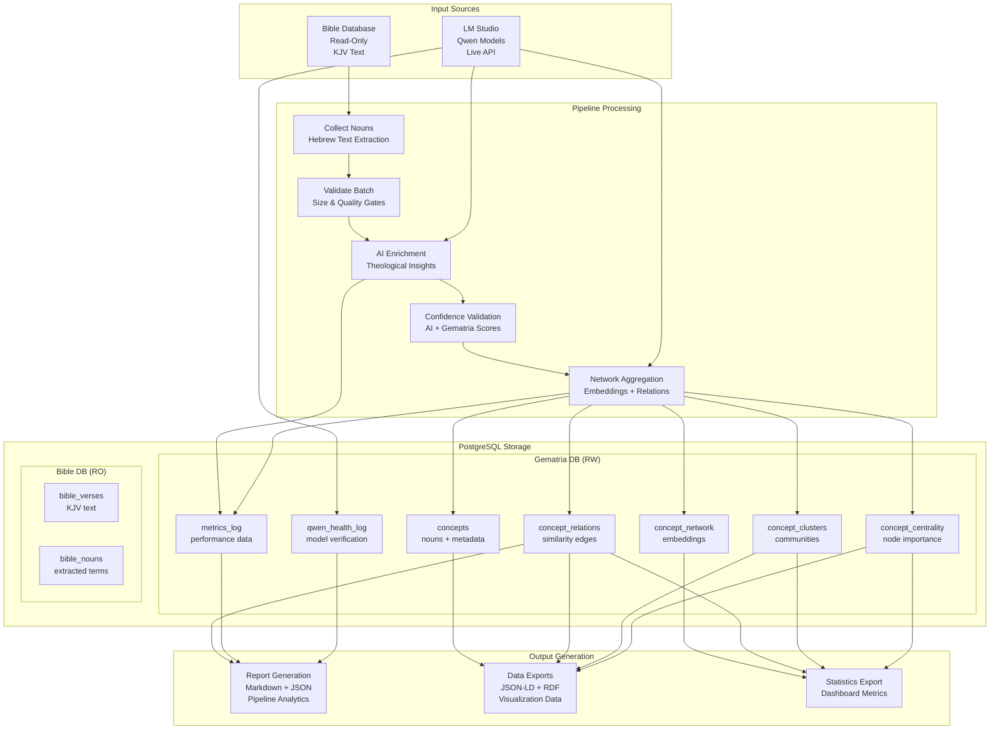
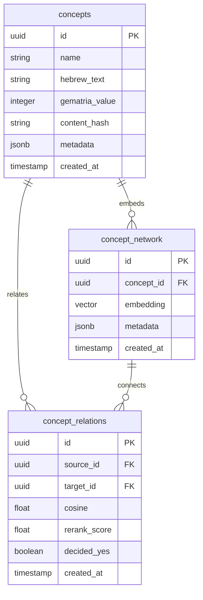
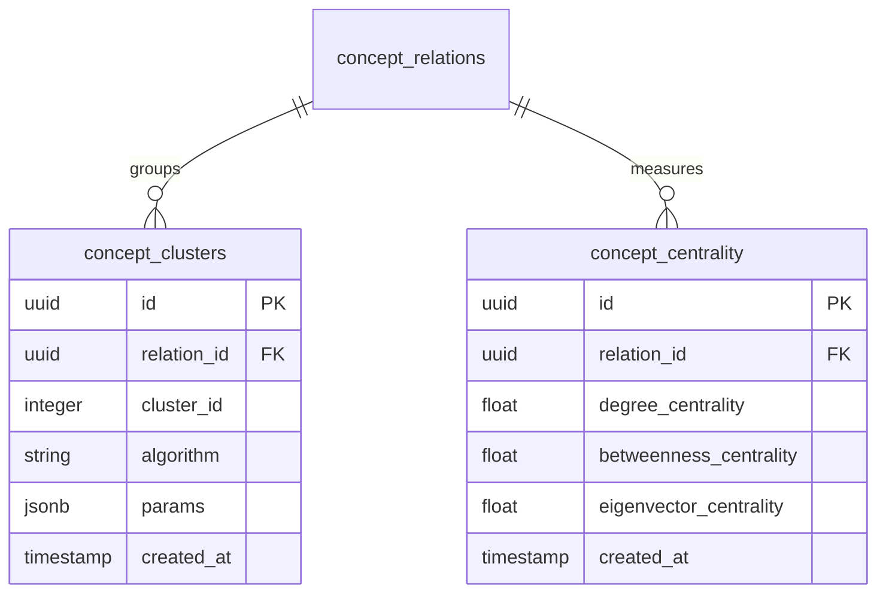
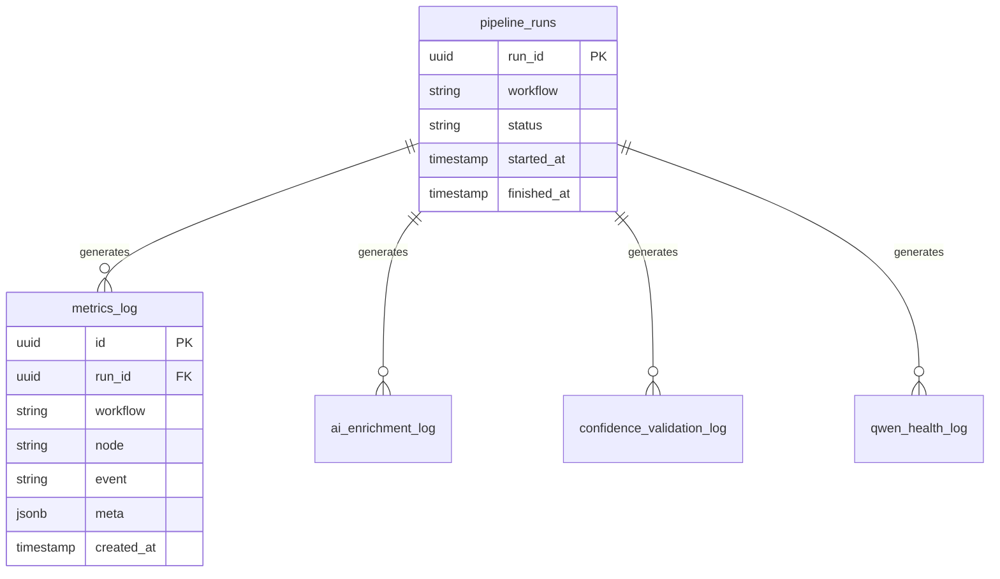
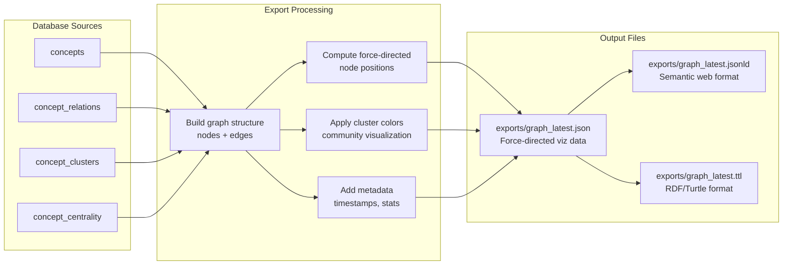
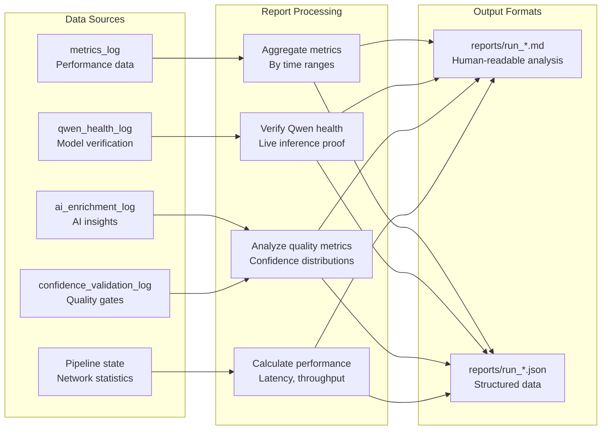

# SSOT: Complete Data Flow Architecture

## Overview
This document provides the single source of truth for Gemantria's complete data flow architecture, showing how data moves through the entire pipeline from input sources to final outputs.

## High-Level Data Flow



## Detailed Pipeline Data Flow

### Stage 1: Data Collection

```mermaid
graph LR
    subgraph "Input"
        VERSES[bible_verses<br/>KJV text by verse]
        NOUNS[bible_nouns<br/>pre-extracted nouns]
    end
    
    subgraph "Collection Logic"
        EXTRACT[Extract Hebrew nouns<br/>from verse text]
        DEDUPE[Deduplicate<br/>by surface form]
        NORMALIZE[Normalize Hebrew<br/>NFKD → NFC]
        HASH[Generate content_hash<br/>SHA-256 identity]
        UUID_GEN[Generate uuidv7<br/>sortable surrogate]
    end
    
    subgraph "Output"
        NOUNS_OUT[nouns: List[str]<br/>Raw noun strings]
        VALIDATED[validated_nouns: List[dict]<br/>Structured noun data]
    end
    
    VERSES --> EXTRACT
    NOUNS --> EXTRACT
    EXTRACT --> DEDUPE
    DEDUPE --> NORMALIZE
    NORMALIZE --> HASH
    HASH --> UUID_GEN
    UUID_GEN --> VALIDATED
```

**Data Transformations:**
- Input: Raw KJV text strings
- Processing: Hebrew text normalization, deduplication
- Output: Structured noun objects with IDs and metadata

### Stage 2: Batch Validation

```mermaid
graph LR
    subgraph "Input"
        NOUNS_IN[validated_nouns<br/>List[dict]]
        CONFIG[Batch Config<br/>batch_size, allow_partial]
    end
    
    subgraph "Validation Logic"
        SIZE_CHECK[Check batch size<br/>≥50 nouns default]
        QUALITY_CHECK[Quality validation<br/>Hebrew normalization<br/>Gematria calculation]
        ALLOW_PARTIAL[ALLOW_PARTIAL=1<br/>Override check]
    end
    
    subgraph "Database Operations"
        BATCH_LOG[Log batch attempt<br/>to batch_log table]
        RESULT_STORE[Store validation results<br/>in batch_results table]
    end
    
    subgraph "Output"
        BATCH_RESULT[batch_result: BatchResult<br/>Success/failure + manifest]
        ERRORS[Validation errors<br/>Detailed failure reasons]
    end
    
    NOUNS_IN --> SIZE_CHECK
    CONFIG --> SIZE_CHECK
    SIZE_CHECK --> QUALITY_CHECK
    QUALITY_CHECK --> ALLOW_PARTIAL
    ALLOW_PARTIAL --> BATCH_LOG
    BATCH_LOG --> RESULT_STORE
    RESULT_STORE --> BATCH_RESULT
    SIZE_CHECK --> ERRORS
```

**Data Transformations:**
- Input: List of validated noun dictionaries
- Processing: Size validation, quality checks, error handling
- Output: BatchResult object with manifest and error details

### Stage 3: AI Enrichment

```mermaid
graph LR
    subgraph "Input"
        NOUNS[validated_nouns<br/>List[dict]]
        MODELS[Theology Model<br/>christian-bible-expert-v2.0-12b]
        MATH[Math Model<br/>self-certainty-qwen3-1.7b-base-math]
    end
    
    subgraph "Processing Logic"
        CONTEXT_BUILD[Build theological context<br/>Verse references + book context]
        PROMPT_ENGINEER[Engineer prompts<br/>150-250 word insights target]
        API_CALL[LM Studio API calls<br/>/v1/chat/completions]
        PARSE_RESPONSE[Parse AI responses<br/>Extract insights + confidence]
        TOKEN_COUNT[Count tokens used<br/>Cost tracking]
    end
    
    subgraph "Database Operations"
        ENRICHMENT_LOG[Log to ai_enrichment_log<br/>prompts, responses, confidence]
        CONFIDENCE_CALC[Calculate confidence scores<br/>AI + token-based metrics]
    end
    
    subgraph "Output"
        ENRICHED[enriched_nouns: List[dict]<br/>Nouns with AI insights]
        TOKENS[token_usage: dict<br/>API usage statistics]
    end
    
    NOUNS --> CONTEXT_BUILD
    CONTEXT_BUILD --> PROMPT_ENGINEER
    PROMPT_ENGINEER --> API_CALL
    MODELS --> API_CALL
    MATH --> API_CALL
    API_CALL --> PARSE_RESPONSE
    PARSE_RESPONSE --> TOKEN_COUNT
    PARSE_RESPONSE --> CONFIDENCE_CALC
    TOKEN_COUNT --> ENRICHMENT_LOG
    CONFIDENCE_CALC --> ENRICHMENT_LOG
    ENRICHMENT_LOG --> ENRICHED
    TOKEN_COUNT --> TOKENS
```

**Data Transformations:**
- Input: Validated nouns with metadata
- Processing: AI prompt engineering, API calls, response parsing
- Output: Enriched nouns with theological insights and confidence scores

### Stage 4: Confidence Validation

```mermaid
graph LR
    subgraph "Input"
        ENRICHED[enriched_nouns<br/>List[dict]]
        THRESHOLDS[Confidence thresholds<br/>ai_soft, ai_hard, gematria]
    end
    
    subgraph "Validation Logic"
        GEMATRIA_CHECK[Validate gematria scores<br/>≥0.9 required]
        AI_CONFIDENCE_CHECK[Validate AI confidence<br/>soft/warn vs hard/fail]
        TOKEN_VALIDATION[Token usage validation<br/>Reasonable consumption]
        QUALITY_GATES[Quality gates<br/>Insight length, coherence]
    end
    
    subgraph "Database Operations"
        VALIDATION_LOG[Log to confidence_validation_log<br/>Validation results + reasons]
        GATE_DECISIONS[Record gate decisions<br/>pass/fail with evidence]
    end
    
    subgraph "Output"
        VALIDATED[confidence_validation: dict<br/>Validation results + stats]
        FILTERED[filtered_nouns: List[dict]<br/>Only passing nouns]
        ERRORS[Validation errors<br/>Failed noun details]
    end
    
    ENRICHED --> GEMATRIA_CHECK
    THRESHOLDS --> GEMATRIA_CHECK
    ENRICHED --> AI_CONFIDENCE_CHECK
    THRESHOLDS --> AI_CONFIDENCE_CHECK
    ENRICHED --> TOKEN_VALIDATION
    ENRICHED --> QUALITY_GATES
    
    GEMATRIA_CHECK --> VALIDATION_LOG
    AI_CONFIDENCE_CHECK --> VALIDATION_LOG
    TOKEN_VALIDATION --> VALIDATION_LOG
    QUALITY_GATES --> VALIDATION_LOG
    
    VALIDATION_LOG --> VALIDATED
    VALIDATION_LOG --> FILTERED
    VALIDATION_LOG --> ERRORS
```

**Data Transformations:**
- Input: AI-enriched nouns with confidence scores
- Processing: Multi-gate validation (gematria, AI, quality)
- Output: Validation results and filtered noun lists

### Stage 5: Network Aggregation

```mermaid
graph LR
    subgraph "Input"
        NOUNS[enriched_nouns<br/>Filtered list]
        EMBEDDING_MODEL[Qwen Embedding<br/>text-embedding-qwen3-embedding-0.6b]
        RERANKER_MODEL[Qwen Reranker<br/>qwen.qwen3-reranker-0.6b]
    end
    
    subgraph "Embedding Generation"
        TEXT_PREP[Prepare embedding texts<br/>Name + insights]
        EMBED_API[LM Studio embedding API<br/>1024-dim vectors]
        L2_NORMALIZE[L2 normalization<br/>Cosine similarity prep]
        STORE_EMBEDDINGS[Store in concept_network<br/>noun_id, embedding, metadata]
    end
    
    subgraph "Relation Discovery"
        KNN_BUILD[Build KNN graph<br/>Top-K similar nodes]
        COSINE_SIM[Calculate cosine similarities<br/>Vector dot products]
        RERANK_FILTER[Optional reranking<br/>Semantic relevance filtering]
        EDGE_PERSIST[Store in concept_relations<br/>source, target, cosine, rerank_score]
    end
    
    subgraph "Network Analysis"
        COMMUNITY_DETECT[Community detection<br/>Louvain algorithm]
        CENTRALITY_CALC[Centrality measures<br/>Degree, betweenness, eigenvector]
        STORE_PATTERNS[Store in concept_clusters<br/>+ concept_centrality]
    end
    
    subgraph "Output"
        NETWORK_SUMMARY[network_summary: dict<br/>Node/edge counts, metrics]
        EMBEDDINGS[Generated embeddings<br/>1024-dim vectors]
        RELATIONS[Semantic relations<br/>Weighted edges]
        PATTERNS[Network patterns<br/>Communities + centrality]
    end
    
    NOUNS --> TEXT_PREP
    TEXT_PREP --> EMBED_API
    EMBEDDING_MODEL --> EMBED_API
    EMBED_API --> L2_NORMALIZE
    L2_NORMALIZE --> STORE_EMBEDDINGS
    STORE_EMBEDDINGS --> EMBEDDINGS
    
    STORE_EMBEDDINGS --> KNN_BUILD
    KNN_BUILD --> COSINE_SIM
    COSINE_SIM --> RERANK_FILTER
    RERANKER_MODEL --> RERANK_FILTER
    RERANK_FILTER --> EDGE_PERSIST
    EDGE_PERSIST --> RELATIONS
    
    RELATIONS --> COMMUNITY_DETECT
    RELATIONS --> CENTRALITY_CALC
    COMMUNITY_DETECT --> STORE_PATTERNS
    CENTRALITY_CALC --> STORE_PATTERNS
    STORE_PATTERNS --> PATTERNS
    
    EMBEDDINGS --> NETWORK_SUMMARY
    RELATIONS --> NETWORK_SUMMARY
    PATTERNS --> NETWORK_SUMMARY
```



**Data Transformations:**
- Input: Enriched nouns with AI insights
- Processing: Embedding generation, similarity computation, pattern discovery
- Output: Semantic network with relations, communities, and centrality measures

## Data Persistence Schema

### Core Entity Tables



### Pattern Analysis Tables



### Observability Tables



## Output Data Formats

### Visualization Exports (JSON)



### Report Generation (Markdown + JSON)



## Data Quality Gates

### Pre-Processing Gates
- **Qwen Live Gate**: All required models verified before pipeline starts
- **Batch Size Gate**: Minimum 50 nouns unless ALLOW_PARTIAL=1
- **Hebrew Normalization**: NFKD→strip→NFC transformation verified

### Post-Processing Gates
- **Confidence Gates**: AI ≥85% (soft) / 95% (hard), Gematria ≥90%
- **Embedding Quality**: 1024-dimensional vectors, L2 normalized
- **Relation Quality**: Cosine similarity thresholds (strong ≥0.90, weak ≥0.75)

### Export Validation
- **Real Data Verification**: Reports contain actual metrics, not placeholders
- **Schema Compliance**: JSON-LD and RDF formats validated
- **Completeness**: All expected fields populated with data

## Performance Characteristics

### Throughput Metrics
- **Collection**: ~1000 nouns/second (database limited)
- **Enrichment**: ~5 nouns/minute (API rate limited)
- **Network**: ~500 embeddings/second (vector operations)
- **Validation**: ~1000 validations/second (in-memory)

### Storage Scaling
- **Concepts**: ~10KB per noun (text + metadata)
- **Embeddings**: ~4KB per vector (1024 float32 values)
- **Relations**: ~100 bytes per edge (IDs + scores)
- **Total per 1000 nouns**: ~50MB (with full network)

### Memory Usage
- **Peak**: ~2GB for 1000-node network processing
- **Persistent**: ~500MB for loaded models and cache
- **Streaming**: Minimal memory for report generation

## Failure Modes & Recovery

### Data Loss Prevention
- **Transactional Writes**: All database operations wrapped in transactions
- **Checkpointer Persistence**: Pipeline state survives restarts
- **Backup Exports**: JSON-LD/RDF provide data portability

### Error Recovery
- **Node-level Failures**: Individual nodes can fail without stopping pipeline
- **Partial Success**: ALLOW_PARTIAL allows processing incomplete batches
- **Resume Capability**: Checkpointer enables continuation from failure points

### Data Consistency
- **Referential Integrity**: Foreign key constraints prevent orphaned records
- **Content Hashing**: SHA-256 ensures data integrity across runs
- **Version Tracking**: Timestamps and run_ids enable audit trails

## Monitoring & Observability

### Metrics Collection
- **Pipeline Metrics**: Node execution times, success rates
- **API Metrics**: LM Studio usage, token consumption, latency
- **Quality Metrics**: Confidence distributions, validation pass rates
- **System Metrics**: Memory usage, database connections

### Alerting Thresholds
- **Pipeline Health**: <95% success rate triggers alerts
- **Model Health**: Qwen health failures abort pipeline
- **Performance**: >5 minute node execution triggers warnings
- **Quality**: <80% confidence pass rate requires investigation

This data flow architecture ensures deterministic, resumable processing with comprehensive observability and quality gates throughout the entire pipeline.
